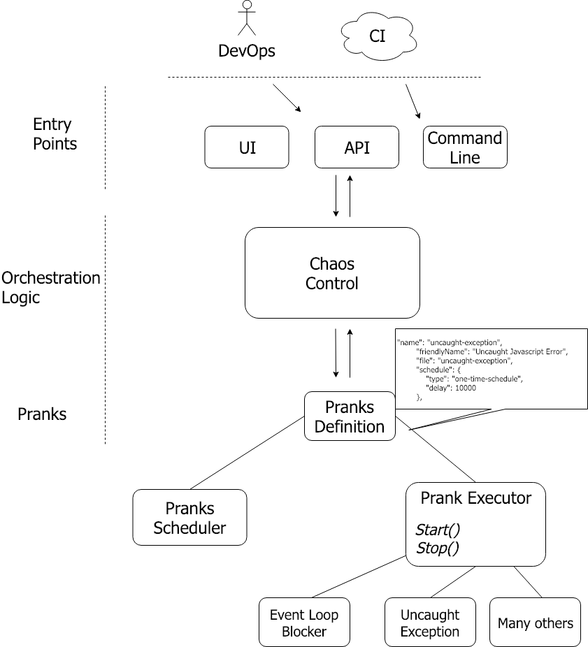

# How to be part of our team

- [How to be part of our team](#how-to-be-part-of-our-team)
  - [Joining our team](#joining-our-team)
  - [Stack](#stack)
  - [Architecture and main components](#architecture-and-main-components)
    - [Glossary](#glossary)
    - [High-level architecture](#high-level-architecture)
  - [How To](#how-to)

## Joining our team
Just open an issue and state your willingness to join the team. Will take care for the rest

## Stack

Node.js backend, no DB, frontend with React, testing with Jest, Travis for CI, . Simple, isn't it?

## Architecture and main components

### Glossary
**Prank -** some act of damage, like overloading the memory or killing a process. 

**Entry Point -** an input technology to start pranks and get pranks data. For example: API, command line, etc

### High-level architecture

## How To
**How do I setup my machine for development?** - simply:
- `Git clone https://github.com/i0natan/node-chaos-monkey`
- `npm i`
- `npm run test:manual`
- Visit http://localhost:8080 and start creating some chaos

Consider developing on a dedicated branch

**How do I test my new code?** - until we will add some automated tests, the only viable alternative is manual testing. For this purpose, we've created a simple express app that host the chaos monkey Under ~/tests/manual-testing-with-simple-web-app.

To start running the test app just type from the root:
`npm run test:manual`

The test app reference the chaos-monkey directly so any changes you'll make will affect immediately without any need to re-publish to npm

**Wanna add a new prank (type of damage)? -** Go to ~/lib/pranks and copy one of the existing pranks, change the class name and override the "Start" and "Stop" methods with your own logic. Then, visit ~/lib/pranks/pranks-definition.js and add your new prank to the list

**Wanna change the UI-** visit ~/ui where the React app is located. An handful of package.json scripts will help you build and watch the code

