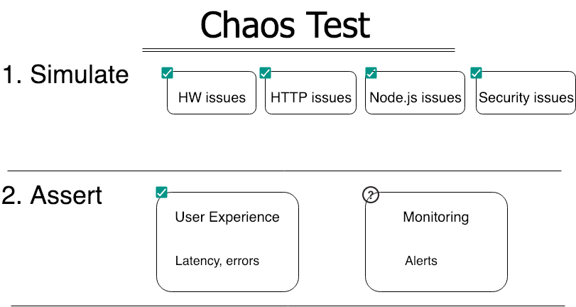

# Extremely naughty Node.js chaos monkey

<h1 align="center">
  
</h1>

<div align="center">
    
</div>

### **Caution: Alpha mode, we're now stabilizing the functionality and enhancing the docs. Consider contributing or visiting again soon**

<br/>

## Don't go to production without 10 minutes of application-level chaos testing

> "A software QA engineer walks into a bar
> 
>He orders a beer. Orders 0 beers. Orders 99999999999 beers. Orders a lizard. Orders -1 beers. Orders a ueicbksjdhd.
>
>First real customer walks in and asks where the bathroom is. The bar bursts into flames, killing everyone."
>
>Credit @brenankeller

Functional bugs are just a subset of the bad things that happen in production. In reality, unplanned chaos will affect your application reliability. How? your process will crash, the event loop might get blocked, many exceptions will not get caught, some unknowns will slow your API, other unknowns will increase your error rate. To name a few. **Unlike most chaos tools, our project is focused on application-level chaos and specifically bad things that happen in Node.js applications**.

Deploy like a pro by spending as little as 10 minutes on Chaos Testing:

**1.** Simulate some bad things (e.g. event loop is blocked, error rate is inclining)

**2.** Approach your APIs to ensure they function correctly 

**3.** Ensure your monitoring systems became aware of the situation
   
**We can seamlessly perform the two first tasks for you using our nit UI or command line**




## 3 min start
### Great for quick experiments, some pranks (damage) won't be available

A. **Install:** `npm install node-chaos-monkey`

B. **Add a flag to start command:** `node -r node-chaos-monkey {your start file.js}`

C. **Trigger chaos using API or UI**: 
- Browse to `http/s://{host}/chaos` and trigger some chaos
- Invoke the API `POST: http/s://{host}/chaos/random`

This will trigger a random chaos, multiple pranks will get executed (e.g. memory overload, uncaught exceptions). Follow the log or the UI to see whatg happened and whether your app stayed resillience

## 5 min start (full functionality)
A. **Install:** `npm install node-chaos-monkey`

B. **Add a reference in your code:** 

Require this package at the very beginning of your app, before registering other routes

```javascript
const ChaosMonkey = require('chaos-monkey');
//pass in a reference to express app so the monkey can generate damage also within Express routes. This param is optional //but without it some pranks won't be available
ChaosMonkey.initialize(your-express-app);
```

C. **Trigger chaos using API or UI**: 
- Browse to `http/s://{host}/chaos` and trigger some chaos
- Invoke the API `POST: http/s://{host}/chaos/random`


## API and full documentation
***1. Get list of available pranks***

Method: GET

Address: http://localhost:8081/chaos/pranks-pool

Sent body: Empty

Return:
`[
    {
        "name": "500-error-on-route",
        "file": "500-error-on-route",
        "active": false,
        "properties": {
            "urls": [
                "/api/products",
                "/anyurl"
            ]
        },
        "schedule": {
            "type": "immediate-schedule",
            "fadeOutInMS": 10000
        }
    }
]
`

***2. Activate a prank***

Method: POST

Address: http://localhost:8081/chaos/pranks-activity

Sent body: 
`
{
      "name": "500-error-on-route",
      "file": "500-error-on-route",
      "active": false,
      "properties": {
        "urls": ["/api/products", "/anyurl"]
      },
      "schedule": {
        "type": "immediate-schedule",
        "fadeOutInMS": 10000
      }
}

    
`
Return:
`
`

***3. Web socket: subscribe to prank***

Method: WS

Address: http://localhost:8081

Event schema:

`
{name: '500-error-on-route', friendlyName: 'API returned a 500 status error', 
  description: 'Our monkey intercepts HTTP routes and return errors on your behalf', lastHappened: new Date(),
  expectations: 'Your monitoring system should notify, error should appear in log',
  reality: 'The process has crashed',
  success: 'Yes' }
`

Example:
`
<script src="https://cdnjs.cloudflare.com/ajax/libs/socket.io/2.0.4/socket.io.js"></script>
    <Script>
        var socket = io('http://localhost:8081');
        var isOkToEmit = true;

        console.log('after')
        socket.on('new-prank-activity', function (data) {
            console.log(`A new prank just ran ${data}`);
        });
    </Script>
    `
